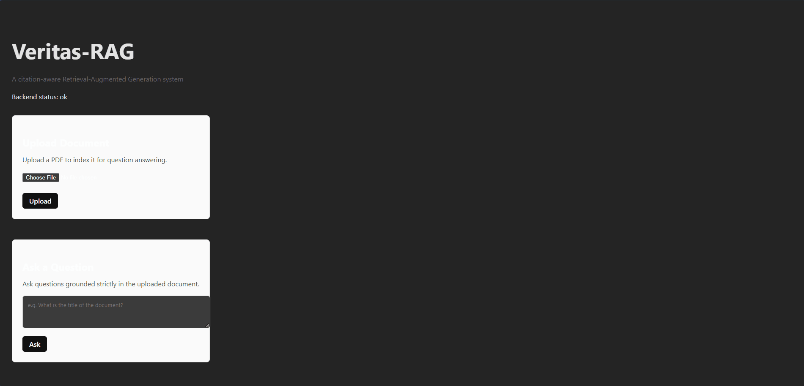
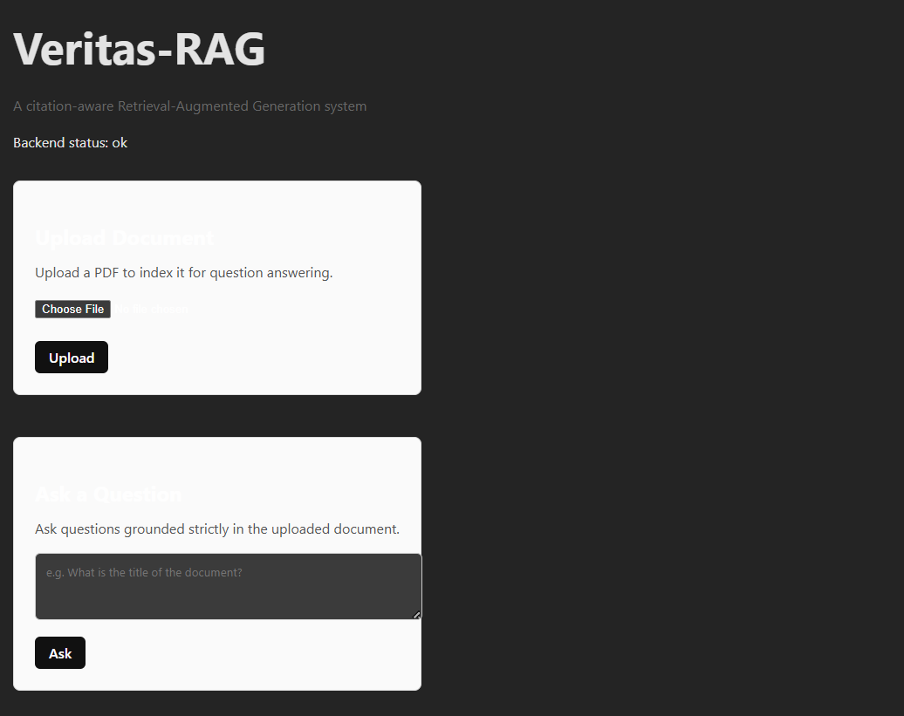
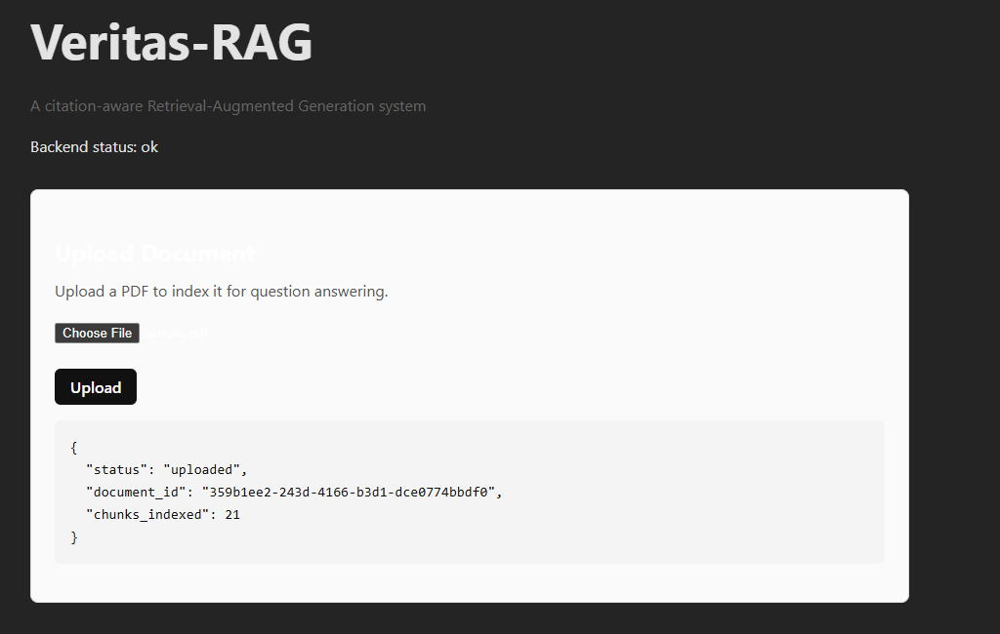
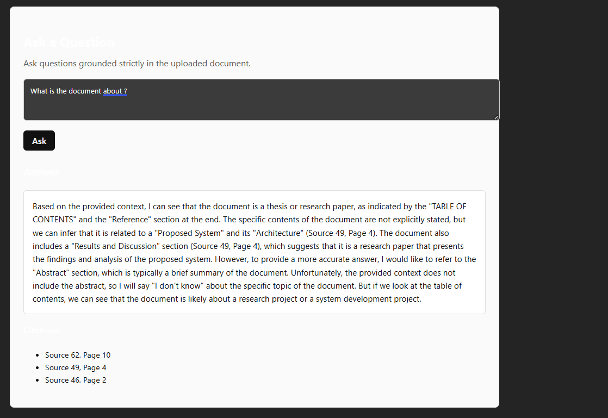

# Veritas-RAG

Veritas-RAG is a citation-aware Retrieval-Augmented Generation (RAG) system designed
to answer questions from documents with **strict grounding and page-level citations**.
The system avoids hallucinations by retrieving relevant document chunks and
forcing the language model to cite exact sources for every factual claim.

## System Architecture

Veritas-RAG follows a strict, modular Retrieval-Augmented Generation pipeline
designed to maximize correctness and traceability.

### 1. Document Ingestion
- PDF documents are loaded page-by-page.
- Text is extracted while preserving page numbers.
- Each page is split into overlapping chunks to retain semantic continuity.

### 2. Embedding
- Each text chunk is converted into a dense vector embedding using a local
  sentence-transformer model.
- Only textual content is embedded; metadata such as page numbers is preserved
  separately.

### 3. Retrieval
- User queries are embedded using the same model.
- Cosine similarity is used to retrieve the top-k most relevant chunks.
- Each retrieved chunk retains its original source index and page number.

### 4. Context Construction
- Retrieved chunks are injected into the prompt with explicit source labels:
  `[Source X, Page Y]`.
- Document-level metadata (e.g., title) is injected explicitly to avoid inference.

### 5. Generation (LLM)
- The language model is instructed to:
  - Use **only** the provided context
  - Cite sources for every factual claim
  - Refuse to answer when information is missing

This design ensures the system produces **grounded, auditable answers**
and avoids hallucinations.

## Example Usage

## Demo

### End-to-End Workflow
Upload a PDF, ask questions, and receive citation-grounded answers generated strictly from the document.

---

### Application Screenshots

**Home & System Status**

**PDF Upload & Indexing**

**Query with Page-Level Citations**

